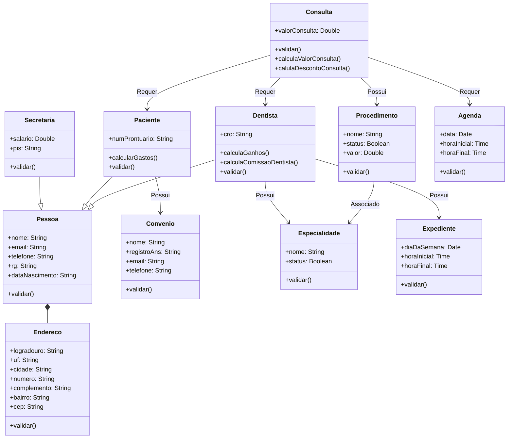

```mermaid
classDiagram

    class Endereco {
    +logradouro: String
    +uf: String
    +cidade: String
    +numero: String
    +complemento: String
    +bairro: String
    +cep: String
    +validar()
    }

    class Pessoa {
    +nome: String
    +email: String
    +telefone: String
    +rg: String
    +dataNascimento: String
    +validar()
    }

    class Secretaria {
    +salario: Double
    +pis: String
    +validar()
    }

    class Convenio {
    +nome: String
    +registroAns: String
    +email: String
    +telefone: String
    +validar()
    }

    class Paciente {
    +numProntuario: String
    +calcularGastos()
    +validar()
    }

    class Consulta {
    +valorConsulta: Double
    +validar()
    +calculaValorConsulta()
    +calulaDescontoConsulta()
    }

    class Dentista {
    +cro: String
    +calculaGanhos()
    +calculaComissaoDentista()
    +validar()
    }

    class Especialidade {
    +nome: String
    +status: Boolean
    +validar()
    }

    class Expediente {
    +diaDaSemana: Date
    +horaInicial: Time
    +horaFinal: Time
    +validar()
    }

    class Procedimento {
    +nome: String
    +status: Boolean
    +valor: Double
    +validar()
    }

    class Agenda {
    +data: Date
    +horaInicial: Time
    +horaFinal: Time
    +validar()
    }

Pessoa *-- Endereco : 
Secretaria --|> Pessoa : 
Paciente --|> Pessoa : 
Dentista --|> Pessoa : 
Paciente --> Convenio : Possui
Consulta --> Paciente : Requer
Consulta --> Procedimento : Possui
Dentista --> Expediente : Possui
Dentista --> Especialidade : Possui
Procedimento --> Especialidade : Associado
Consulta --> Agenda : Requer
Consulta --> Dentista : Requer

```
